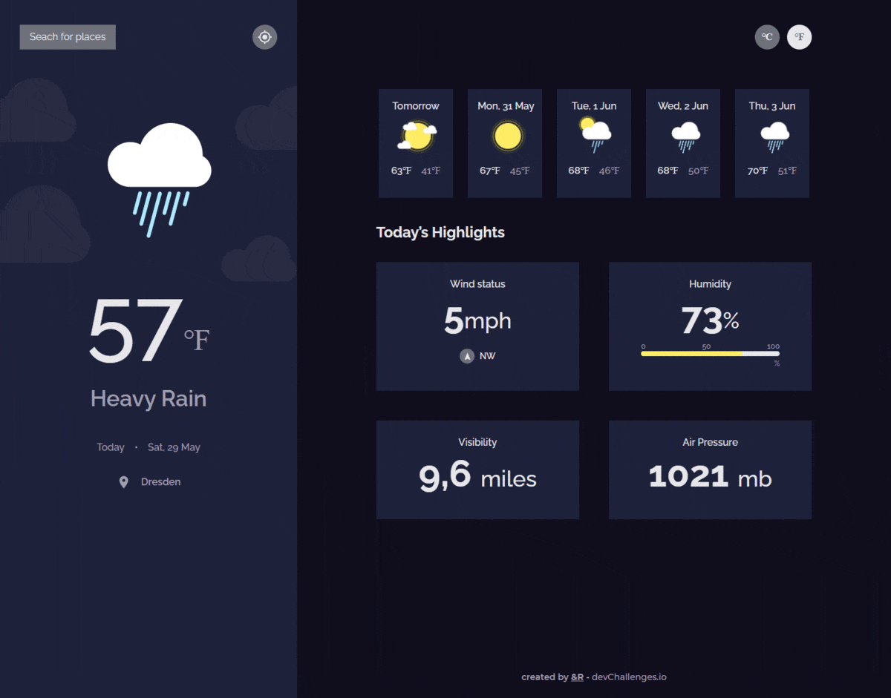

<h1 align="center">Weather-App</h1>

<div align="center">
   Solution for a challenge from  <a href="http://devchallenges.io" target="_blank">Devchallenges.io</a>.
</div>

<div align="center">
  <h3>
    <!-- <a href="https://{your-demo-link.your-domain}">
      Demo
    </a>
    <span> | </span> -->
    <a href="https://github.com/RauboLuk/Weather-App">
      Solution
    </a>
    <span> | </span>
    <a href="https://devchallenges.io/challenges/mM1UIenRhK808W8qmLWv">
      Challenge
    </a>
  </h3>
</div>

<!-- TABLE OF CONTENTS -->

## Table of Contents

- [Overview](#overview)
  - [Built With](#built-with)
- [Features](#features)
- [How to use](#how-to-use)
- [Contact](#contact)
- [Acknowledgements](#acknowledgements)

## Overview


ETC~15h

### Built With

- [API](https://www.metaweather.com/api/)
- [date-fns](https://date-fns.org/)
- [React](https://reactjs.org/)
- [Tailwind](https://tailwindcss.com/)
<!-- - [Axios](https://axios-http.com/)
- [axios-hooks](https://www.npmjs.com/package/axios-hooks)
- [CRACO](https://www.npmjs.com/package/@craco/craco)
- [Cors-anywhere](https://cors-anywhere.herokuapp.com/)
- [Material-UI](https://material-ui.com/)
- [Prettier](https://prettier.io/) -->

## Features

This application/site was created as a submission to a [DevChallenges](https://devchallenges.io/challenges) challenge. The [challenge](https://devchallenges.io/challenges/mM1UIenRhK808W8qmLWv) was to build an application to complete the given user stories.

- [x] **User story**: I can see city weather as default, preferably my current location
- [x] **User story**: I can search for city
- [x] **User story**: I can see weather of today and the next 5 days
- [x] **User story**: I can see the date and location of the weather
- [x] **User story**: I can see according to image for each type of weather
- [x] **User story**: I can see the min and max degree each day
- [x] **User story**: I can see wind status and wind direction
- [x] **User story**: I can see humidity percentage
- [x] **User story**: I can see a visibility indicator
- [x] **User story**: I can see the air pressure number
- [x] **User story**: I can request my current location weather
- [x] **User story**: I can convert temperature in Celcius to Fahrenheit and vice versa

## How To Use

<!-- Example: -->

To clone and run this application, you'll need [Git](https://git-scm.com) and [Node.js](https://nodejs.org/en/download/) (which comes with [npm](http://npmjs.com)) installed on your computer. From your command line:

```bash
# Install dependencies
$ npm install

# Run the app
$ npm start
```

## Acknowledgements

- [React Background Image Tutorial](https://www.freecodecamp.org/news/react-background-image-tutorial-how-to-set-backgroundimage-with-inline-css-style/)
- [Change color of PNG image via CSS?](https://stackoverflow.com/a/53206065)
- [Tailwind parenthover behaviour](https://github.com/tailwindlabs/discuss/issues/115#issuecomment-362100955)

## Contact

- GitHub [@RauboLuk](https://github.com/RauboLuk)
- Stack Overflow [@RauboLuk](https://stackoverflow.com/users/9185799/rauboluk)
